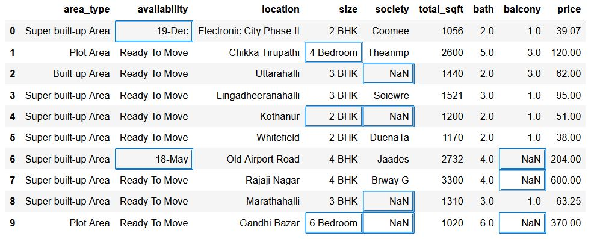
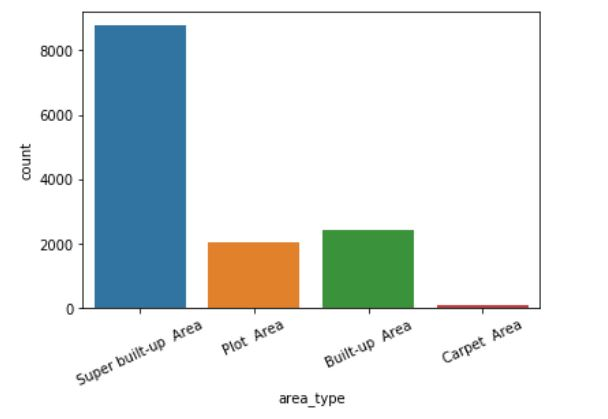
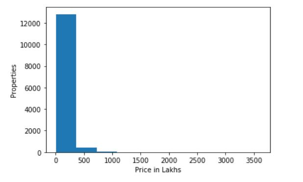

# Property Price Prediction
[Price Prediction App](https://price--prediction-app.herokuapp.com)

A Machine Learning based project deployed on Heroku and developed with Python and streamlit library. Supervised Machine Learning problem, solved using Linear Regresssion with a **test accuracy of more than 85%** 

**Problem Statement -** Predict the property prices based on Information provided by user.
## Data
Dataset contains 9 variables (8 independent and 1 target) and more than 13000 records. Data is in tedious form and needs to be cleaned for further processing.  
So below is a snap of only 10 records from our data and it can be seen that there are a lot of ambiguities (highlighted) in data.

## Exploring Data (EDA)
Before satarting any Data Science Project, knowing Problem Statement and the data one is going to work upon are must. 
Looking at problem statement it gets cleared enough how to proceed and what sort of data we need, from data present with us.  
So, Exploratory Data Analysis (EDA) comes in handy for data filtering.

### Types of Areas available
Here am working on Property data so it is best practice to know, what types of properties are there and what is there count. So for that am using plotting method to easily get an idea about the same.

### Missing Values in Data

### Price Distribution

